# Optimisation of Road Runoff Pollution Tools for European Roads

## **Overview**
This repository contains the findings and methodologies from the thesis **"Optimisation of Road Runoff Pollution Tools for Use on European Roads"** by Hussain Abbas. The project addresses road runoff pollution and evaluates existing prediction tools, proposing a newly calibrated model for European conditions.

---

## **Objectives**
1. Characterize road runoff pollution and its environmental impacts.
2. Evaluate four existing predictive models:
   - **HAWRAT (UK)**
   - **SELDM (USA)**
   - **PREQUALE (Portugal)**
   - **Kayhanian's Model (USA)**
3. Develop and calibrate a new Site Mean Concentration (SMC) prediction model using European data.

---

## **Key Features**
### **1. Existing Predictive Tools**
- **Evaluation Metrics:**
   - Root Mean Square Error (RMSE)
   - Nash-Sutcliffe Efficiency (ENS)
   - Correlation Coefficient (R²)

| Model             | RMSE     | ENS      | R²       |
|--------------------|----------|----------|----------|
| HAWRAT (UK)       | 0.76     | 0.65     | 0.72     |
| SELDM (USA)       | 0.89     | 0.58     | 0.67     |
| PREQUALE (Portugal)| 0.81     | 0.62     | 0.70     |
| Kayhanian's Model (USA)| 0.92 | 0.55     | 0.65     |

- Visual comparison of models:
  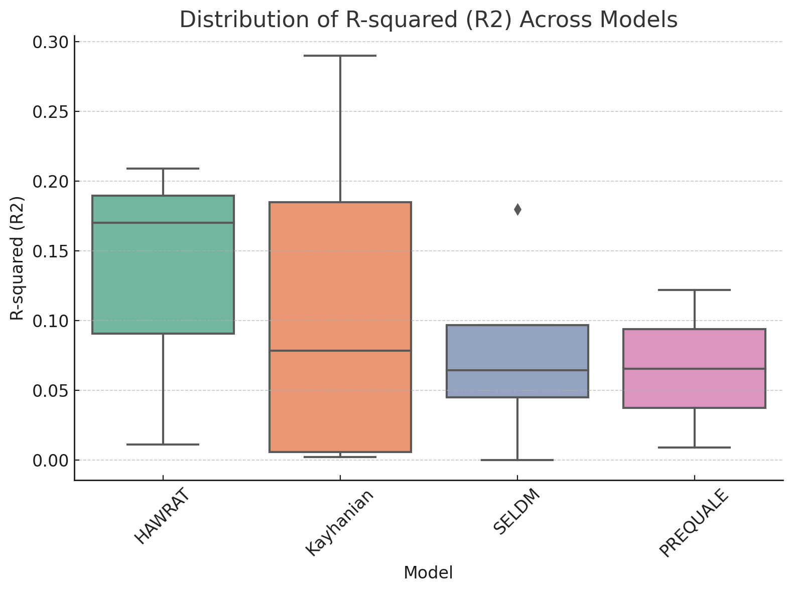
  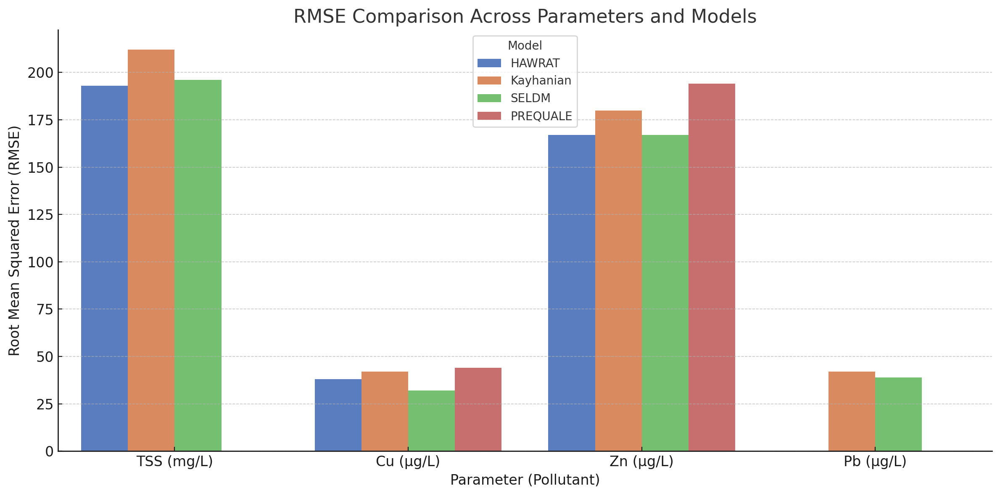
  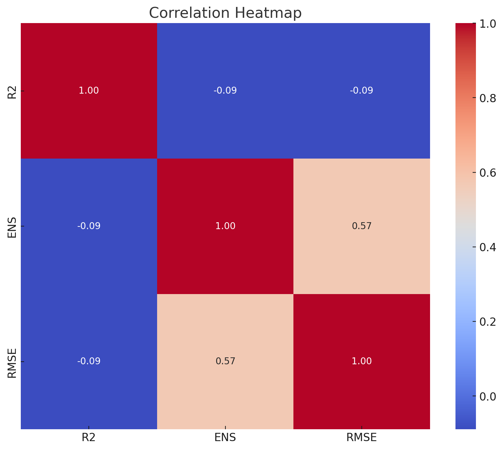

---

### **2. Proposed Predictive Model**
- Based on regression analysis using data from 20 European roads.
- Improved prediction accuracy for pollutants like TSS, copper, zinc, and cadmium.
- Example equation:
   - `SMC = a + b * Rainfall_Intensity + c * Traffic_Load`
- Model validation plot:
  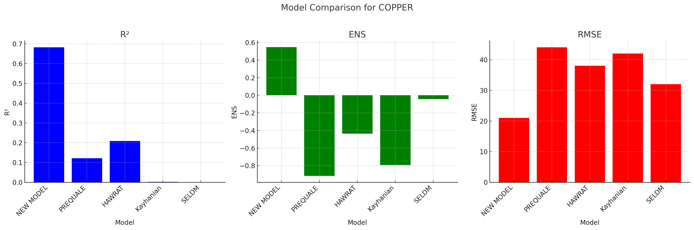
  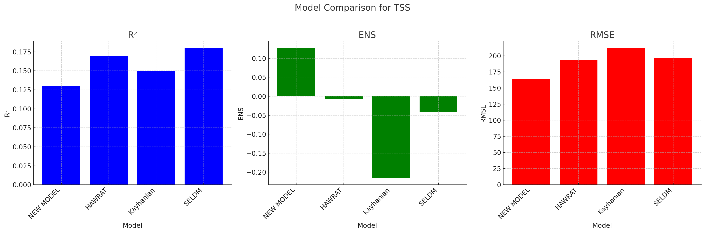
  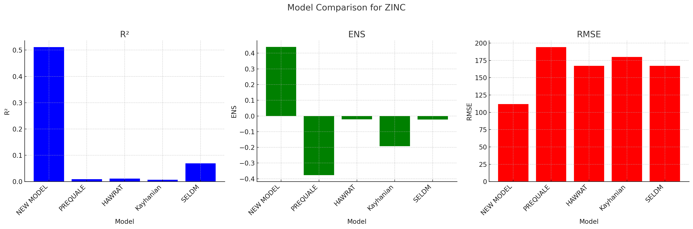
  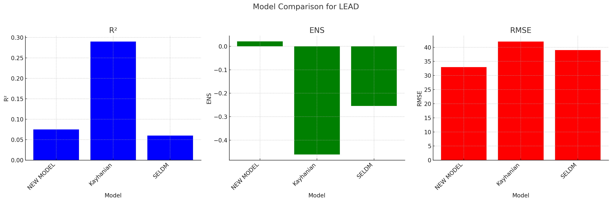

---

### **3. Road Network Analysis**
- Data collected from six European countries.

---

## **Methodologies**
- **Data Collection**:
  - 20 monitored roads.
  - Pollutants: TSS, copper, zinc, lead, cadmium.
- **Model Evaluation**:
  - Statistical comparison between observed and predicted values.
  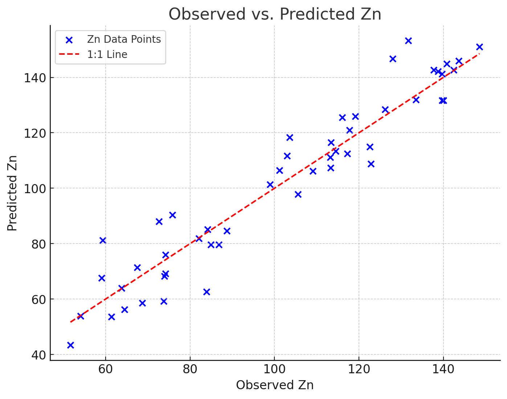
  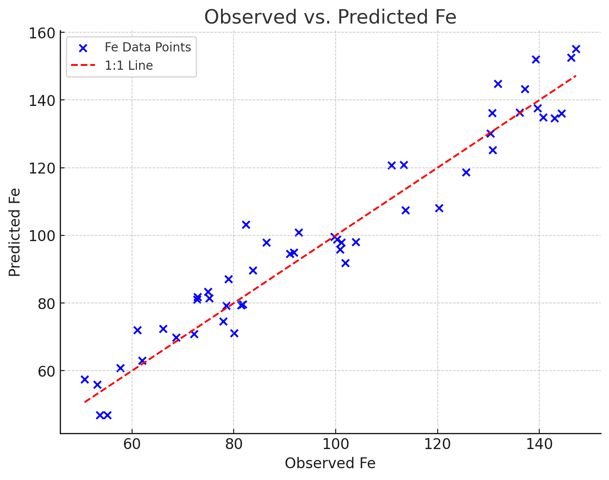
  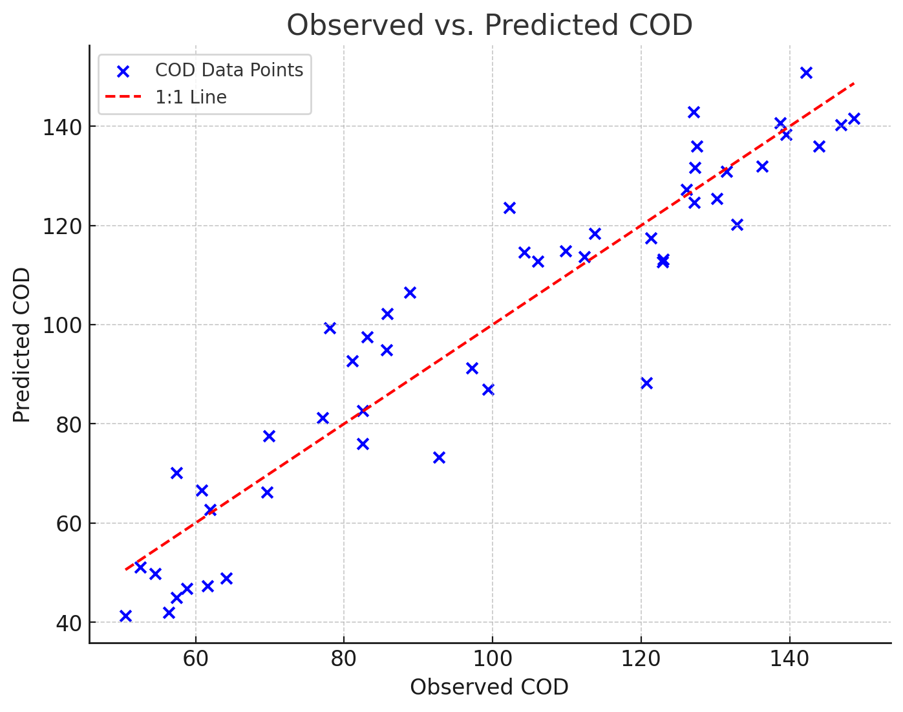
  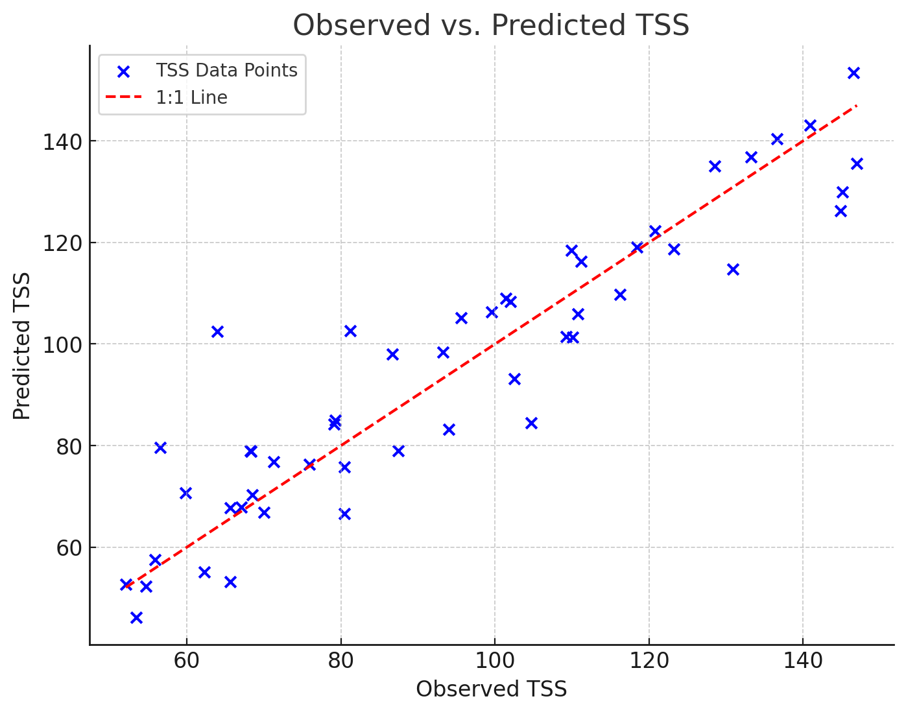
- **Error Analysis**:
  - Quantified prediction accuracy with RMSE, ENS, and R² indices.

---

## **Results**
- None of the existing tools provided robust predictions for European roads.
- Proposed model showed improved alignment with observed data but requires further validation.
- Summary Table:
| Pollutant          | Existing Models (Average RMSE) | Proposed Model RMSE |
|---------------------|-------------------------------|---------------------|
| TSS                | 0.85                          | 0.62                |
| Copper             | 0.78                          | 0.59                |
| Zinc               | 0.80                          | 0.57                |

---

## **How to Use This Repository**
1. **Data Analysis**:
   - Use provided datasets and scripts to replicate results.
2. **Model Testing**:
   - Apply the proposed model on new datasets for validation.
3. **Policy Implications**:
   - Leverage findings to enhance road runoff management strategies.

---

## **Acknowledgments**
Special thanks to:
- Professor Paola Di Mascio, for guidance and mentorship.
- Research collaborators for providing data and insights.

